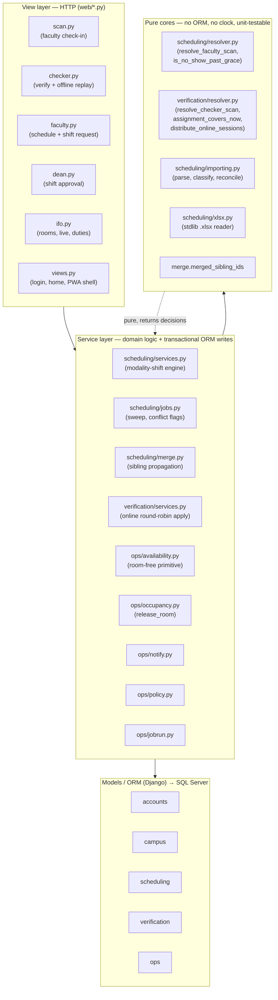
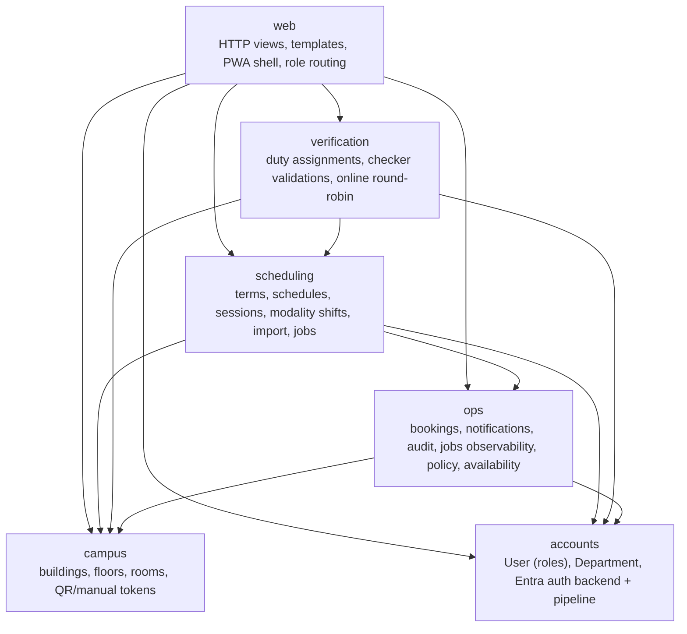
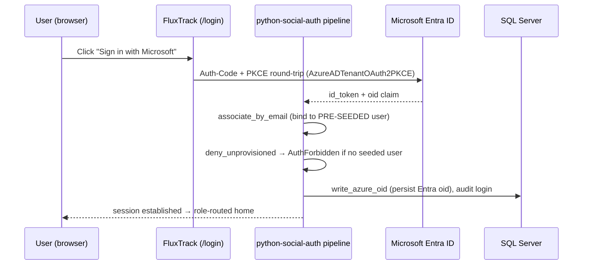
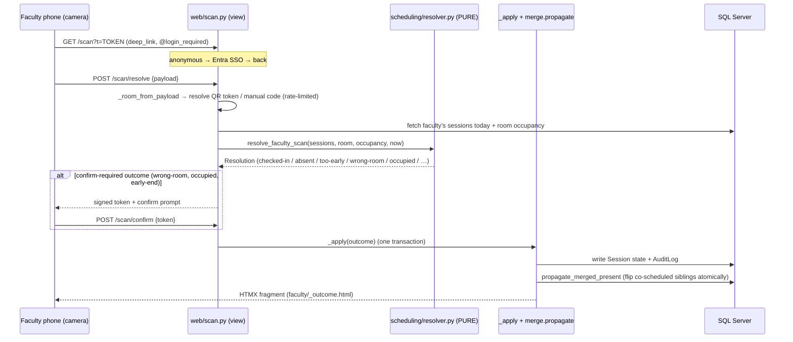
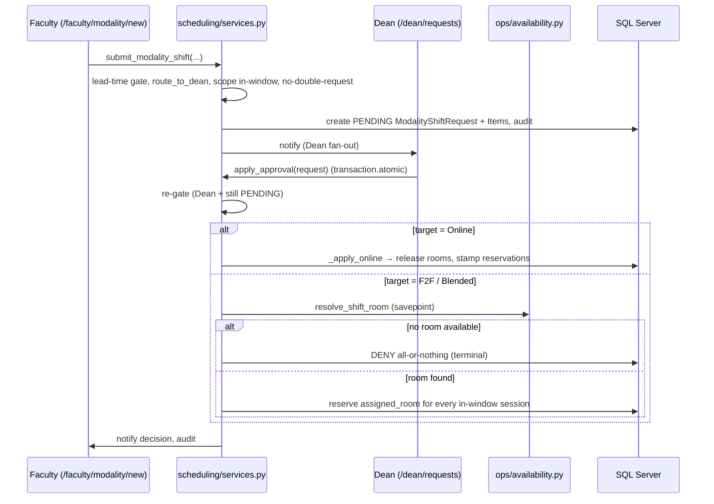
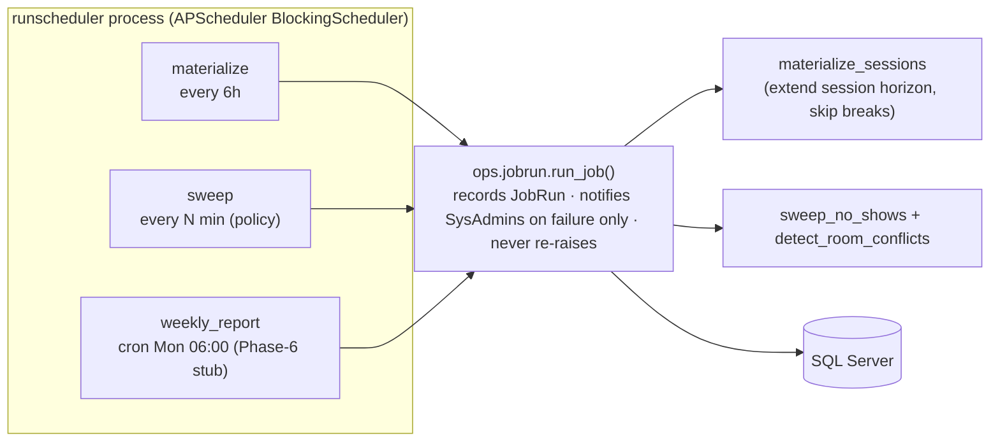
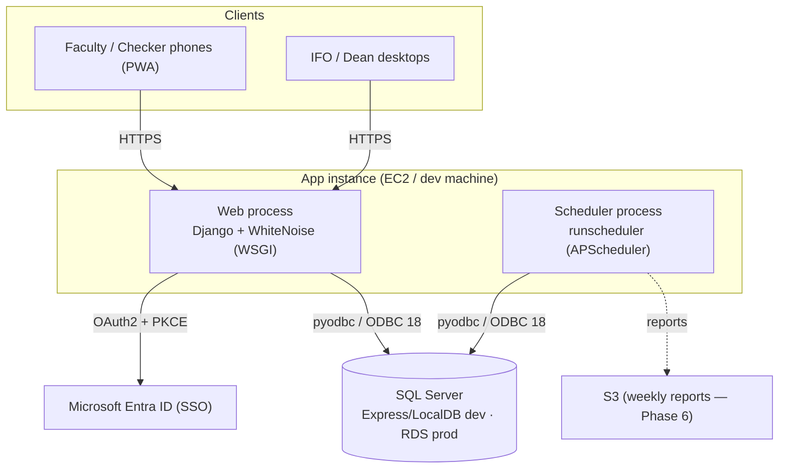

# FluxTrack — System Architecture

> **What it is:** FluxTrack is Malayan Colleges Mindanao's (MMCM) *Faculty Attendance & Facility
> Utilization Information System*. It records whether faculty actually attend their scheduled
> sessions and how campus rooms are used, replacing manual roving-checker paperwork with a
> **server-authoritative** scan/verify flow, live occupancy, and reporting.

This document describes the architecture of the app **as it currently stands in the repository**.
For the exact relational schema see [`docs/db_schema.sql`](./db_schema.sql).

---

## 1. Technology stack

| Concern | Choice | Notes |
|---|---|---|
| Web framework | **Django 6.0** | Server-rendered, one project (`config/`) + 6 local apps |
| API layer | **Django REST Framework** | Session auth; used for the few JSON endpoints (offline replay, live polling) |
| Database | **Microsoft SQL Server** only (dev/test/prod) | via `mssql-django` + ODBC Driver 18; local Express/LocalDB, prod RDS |
| Identity | **Microsoft Entra ID SSO** (OAuth2 Auth-Code + PKCE) | via `python-social-auth`; DEBUG passwordless dev-login stub as fallback |
| Background jobs | **APScheduler** (`BlockingScheduler`) | one dedicated process, never a web worker |
| Frontend | **Server-rendered templates + Franken UI (Tailwind) + HTMX** | progressive enhancement; **PWA** (manifest + service worker) |
| Static files | **WhiteNoise** | compressed/manifest storage, served from the app process |
| Reports / media | qrcode + Pillow (QR posters), pypandoc (SRS docx) | weekly report → S3 is a Phase 6 stub today |
| Timezone | **Asia/Manila**, `USE_TZ=True` | all datetimes tz-aware |

Configuration is **env-driven** (`.env` / `.env.example`) so the same code runs across
environments — only `DB_*` and `SOCIAL_AUTH_*` values differ.

---

## 2. Architectural principle: pure core → service → thin view

The single most important idea in the codebase is a strict **three-tier discipline**. Every
domain decision is made in a *pure* function (no ORM, no wall-clock), state changes happen in a
thin *service/apply* seam, and HTTP *views* only fetch context, validate input **format**, and
render.

**Recurring invariants enforced everywhere:**

- **Server never trusts the client.** Room IDs come from resolving an opaque QR token or a
  rate-limited manual code — never a client-supplied `room_id`. Times come from the server clock.
- **Every state change writes an `AuditLog`** (SYS-03, §6.2). `ops.notify` is the *only* place
  that never audits, because the triggering domain action already did.
- **One predicate, one source of truth.** e.g. `is_no_show_past_grace` is shared by both scan-time
  and the background sweep, so they can never disagree; `assignment_covers_now` gates floor scans,
  online duty, *and* round-robin eligibility.
- **`list()`-materialize querysets before writes** — a deliberate MSSQL/pyodbc `HY010` guard.
- **Every tunable flows through `ops.policy.get_policy`** (DB `SystemSetting` overrides the
  `settings.FLUXTRACK_POLICY` default) — never a hardcoded literal.

---

## 3. Application map (Django apps)

Each app owns a slice of the domain. Dependencies point downward (nothing depends on `web`).

| App | Responsibility | Key modules |
|---|---|---|
| **accounts** | Identity & org. Custom `User` (7 roles, one each) extending `AbstractUser`, `Department`. Entra SSO wiring. | `backends.py` (PKCE), `pipeline.py` (`deny_unprovisioned`, `write_azure_oid`) |
| **campus** | Physical spaces: `Building` → `Floor` → `Room`. Room carries the case-sensitive `qr_token`/`manual_code` resolver credentials. | `models.py` |
| **scheduling** | The academic core: `AcademicTerm`/`Break`, `Schedule` (recurring slot), `Session` (dated occurrence), `ModalityShiftRequest`/`Item`. Import + jobs + resolver. | `resolver.py`, `services.py`, `jobs.py`, `merge.py`, `importing.py`, `xlsx.py` |
| **verification** | Duty & verification: `Assignment` (checker/guard on-duty grant), `CheckerValidation` (source-of-truth confirmation). | `resolver.py`, `services.py` |
| **ops** | Cross-cutting operations: `Booking`, `Notification`, `PushSubscription`, `AuditLog`, `RoomConflictFlag`, `JobRun`, `SystemSetting`, `WeeklyReport`. | `availability.py`, `occupancy.py`, `notify.py`, `policy.py`, `jobrun.py` |
| **web** | The only HTTP surface. Role-gated view modules, templates, PWA shell, role-routed home. | `scan.py`, `checker.py`, `faculty.py`, `dean.py`, `ifo.py`, `views.py`, `urls.py` |
| **config** | Project settings, root URLconf, WSGI/ASGI. | `settings.py`, `urls.py` |

Data model detail (tables, columns, constraints, indexes) lives in
[`docs/db_schema.sql`](./db_schema.sql).

---

## 4. Roles & routing

`accounts.User` holds exactly one of seven roles. The single `home()` view routes each role to its
own surface set (`SURFACES` map), and every view module has its own role-guard decorator
(`faculty_required`, `checker_required`, `dean_required`, `ifo_required`).

| Role | Primary surfaces (URL prefix) |
|---|---|
| **Faculty** | `/faculty/schedule`, `/faculty/scan`, `/faculty/modality/*` |
| **Checker** | `/checker/scan`, `/checker/floor`, `/checker/online`, `/checker/replay` |
| **IFO Admin** | `/ifo/rooms`, `/ifo/live`, `/ifo/assignments` |
| **Dean** | `/dean/requests` (approve / reject) |
| **HR Admin** | attendance / flags (Phase 6) |
| **Guard** | floor monitor / locator (Phase 6) |
| **System Admin** | Django `/admin/`, audit log |

---

## 5. Authentication

Two authentication backends are configured, **PKCE first**:

- **`AzureADTenantOAuth2PKCE`** (`accounts/backends.py`) mixes `BaseOAuth2PKCE` *ahead* of the
  Azure backend, because the stock backend silently ignores `USE_PKCE`.
- The pipeline has **`create_user` removed** — only **pre-provisioned** seeded users can sign in.
  An unknown tenant identity raises `AuthForbidden`, intercepted by `SocialAuthExceptionMiddleware`
  and redirected to `/login` with a message (never a raw 500).
- **DEBUG dev-login** (`web/views.login_view`) is a passwordless "sign in as this seeded user"
  stub, gated behind `settings.DEBUG` and never reachable in production. `ModelBackend` is named
  explicitly there because two backends are configured.

---

## 6. Core flow: the scan / QR resolver (server-authoritative)

The heart of the system. A faculty check-in and a checker verification share the **same shape**:
resolve an opaque credential → call a pure decision core → (maybe confirm) → apply + audit.

Key properties:

- **No writes happen during resolution** — the pure core only returns a decision.
- **Confirm-required outcomes** get a signed token so a destructive action (e.g. room change,
  force-handover) is only applied on explicit re-POST.
- **Merged siblings:** co-scheduled sections (same faculty, same start, same room/course) flip
  together in one atomic `.update()`, so an unscanned sibling is never falsely marked Absent.
- **Checker path** (`web/checker.py` → `verification/resolver.resolve_checker_scan`) mirrors this,
  and adds a JSON **`/checker/replay`** endpoint: offline scans queued in the browser (IndexedDB,
  `static/checker/offline_queue.js`) are re-validated **server-side** through the same pure core.

---

## 7. Modality-shift workflow (Faculty → Dean)

A faculty member requests shifting session(s) online or to another room; the department Dean
approves. All mutation/audit/notify lives in `scheduling/services.py`; views only validate format.

Approved shifts also apply to **future, not-yet-materialized** sessions: `materialize_sessions`
has a *born-released / born-assigned* hook (`_apply_approved_shift`) so sessions created later in
the horizon already carry the approved modality/room.

---

## 8. Background jobs — the single dedicated scheduler

All scheduled work runs in **one** `BlockingScheduler` inside the `runscheduler` management
command — **never** inside a Gunicorn/web worker or `AppConfig.ready()` (that would start one
scheduler per worker and double-fire every job, the exact failure ENV-04 prohibits).

- Every job is wrapped by **`run_job`**, which writes exactly one `JobRun` row
  (`running → ok|failed`, `rows_affected`, timestamps), alerts System Admins **on failure only**,
  and **never re-raises** so one bad tick can't kill the long-lived process.
- The same logic is also callable **one-shot** for ops/testing:
  `run_status_sweep`, `materialize_sessions`, `assign_online`.
- **Cadences are policy-driven** (`sweep_interval_minutes`), not magic numbers.

**Other management commands:** `seed_demo` (demo data per role), `link_entra` (repoint a seeded
user's email to a real Entra UPN), `import_offerings` + `load_room_master` + `reset_term` (the
registrar `.xlsx` import pipeline, using the pure `importing`/`xlsx` helpers with a four-bucket
reconciliation proof that nothing is silently dropped), and `regenerate_srs_docx`.

---

## 9. Frontend & PWA

- **Server-rendered** Django templates styled with **Franken UI** (Tailwind-based) — currently via
  CDN for dev; a standalone CLI build is wired later.
- **HTMX** for partial updates: scan outcomes, floor board rows, live-room polling, and Dean/IFO
  queues return HTML fragments (`templates/**/_partial.html`). CSRF is injected globally via
  `hx-headers` in `base.html`.
- **PWA**: `/manifest.webmanifest`, a service worker (`/sw.js`, network-first navigations with a
  `/login` offline fallback, cache-first static assets), and dynamically-resized MMCM-crest icons.
- **Offline queue**: checkers on the floor may be offline; scans are queued client-side and later
  replayed to `/checker/replay` for authoritative server-side re-validation.
- **Phone-first**, WCAG 2.1 AA target, ≥44px touch targets, no state conveyed by color alone.

---

## 10. Deployment topology

- **Two processes on one instance**, one database: the web app and the dedicated scheduler run
  side by side (a second terminal in dev; a second `systemd` unit in prod).
- Static files are served **from the app** by WhiteNoise (no separate static host needed).
- Encryption to the DB is env-driven: local Express trusts a self-signed cert; RDS uses a real
  cert chain — the only difference is `DB_ODBC_EXTRA` in each `.env`.

---

## 11. Cross-cutting conventions (quick reference)

| Convention | Where it lives | Why |
|---|---|---|
| Server-authoritative resolution | `web/scan.py`, `web/checker.py` | Client never supplies room IDs or times |
| Audit on every write | `ops.AuditLog` writes in every apply seam | Official record of change (SYS-03) |
| One notification write path | `ops/notify.py` | Consistent fan-out; no double-audit |
| Policy over literals | `ops/policy.py` (`get_policy`) | Tunables overridable per-deployment via `SystemSetting` |
| Shared predicates | `is_no_show_past_grace`, `assignment_covers_now` | Scan-time and job-time can never diverge |
| `list()` before writes | services/jobs | MSSQL/pyodbc `HY010` guard |
| Case-sensitive tokens only | `campus_room.qr_token`, `manual_code` (`*_CS_AS`) | Case-variant tokens must never collide (security) |
| Job observability | `ops/jobrun.py` (`JobRun`) | Last-run status queryable; failures alert SysAdmins |

---

*Generated from the current codebase. Companion artifact: [`docs/db_schema.sql`](./db_schema.sql)
(exact SQL Server DDL).*
