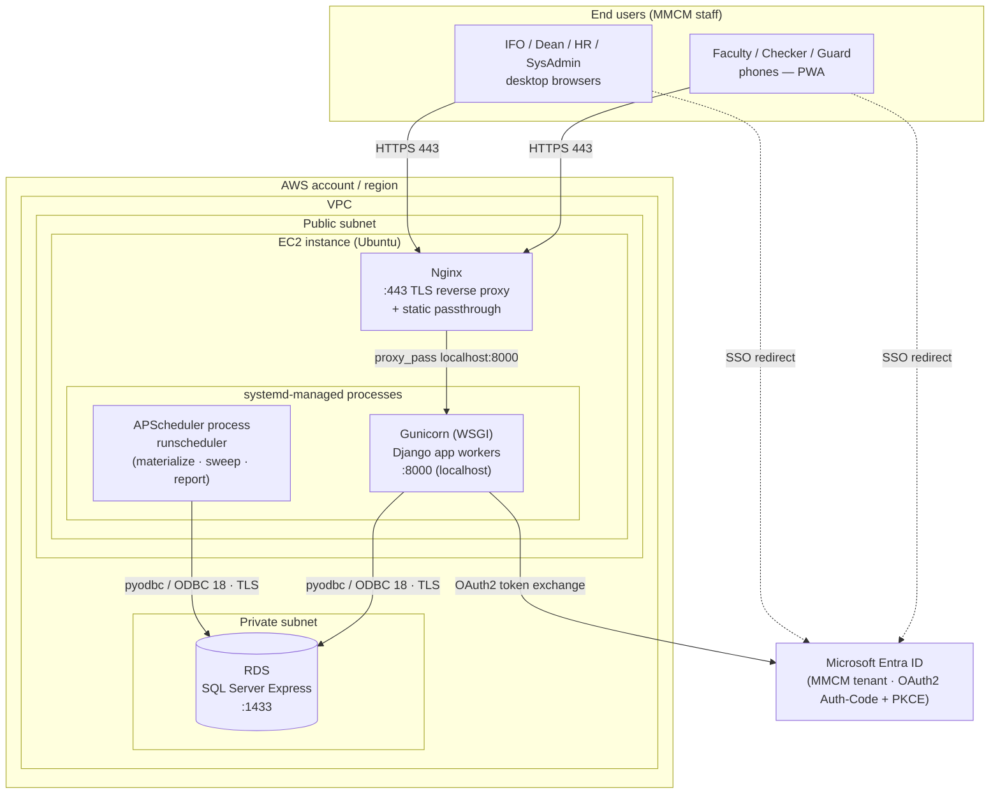
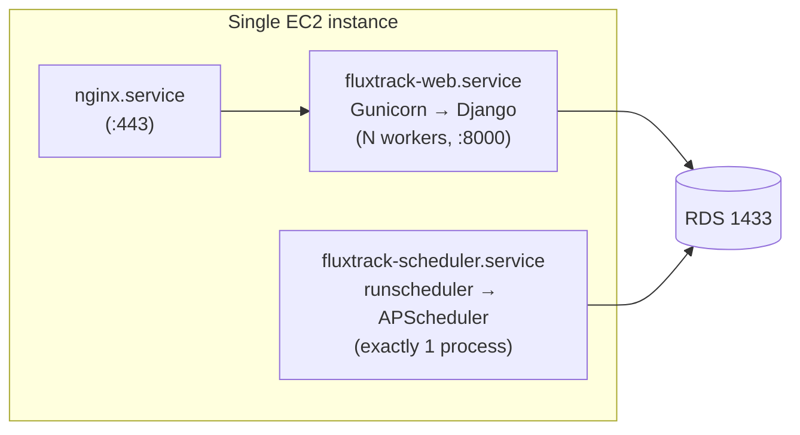
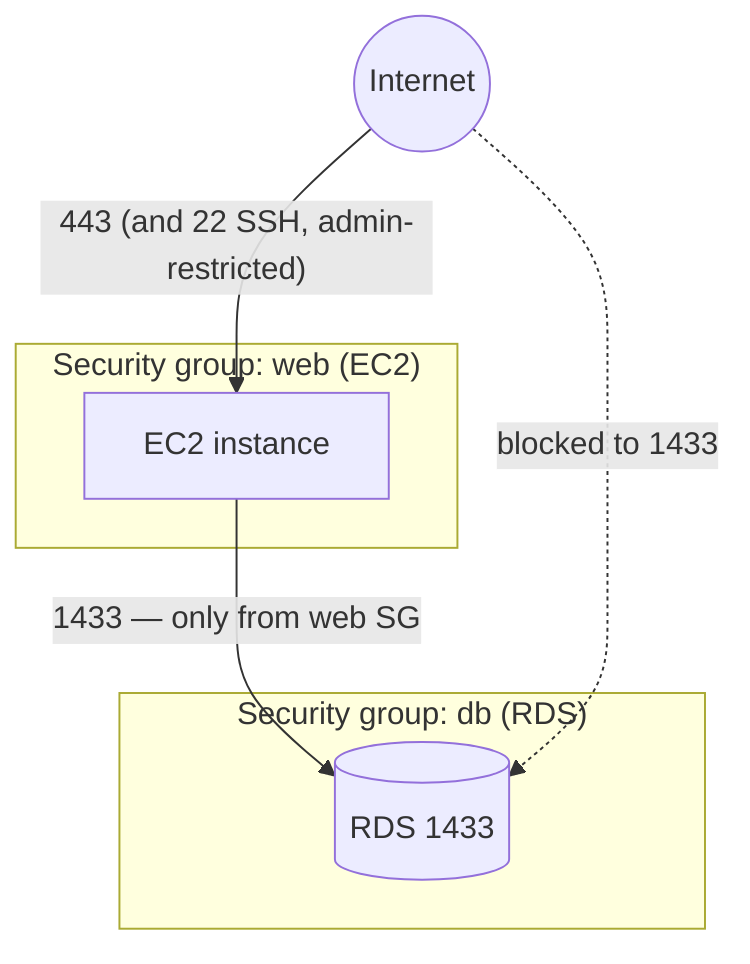

# FluxTrack — IT / Infrastructure Architecture

> This document describes **where FluxTrack runs and how the pieces connect** — the hosting,
> network, servers, processes, and security boundaries. For the *software* architecture (code
> layers, request flows) see [`docs/ARCHITECTURE.md`](./ARCHITECTURE.md); for the database schema
> see [`docs/db_schema.sql`](./db_schema.sql).

FluxTrack is deliberately a **"simplest possible"** deployment sized for capstone scale: a
**single application instance** talking to a **single managed database**, with an **external
identity provider**. No Kubernetes, no microservices, no separate frontend server.

---

## 1. Environments at a glance

| | **Local development** | **Production (target: AWS)** |
|---|---|---|
| Compute | The dev laptop (`manage.py runserver`) | **1 × EC2** instance |
| Web server | Django dev server (`runserver`) | **Nginx** (reverse proxy) → **Gunicorn** (WSGI) |
| Scheduler | `runscheduler` in a 2nd terminal | **APScheduler** as a 2nd **systemd** unit |
| Database | **SQL Server 2025 LocalDB** (Windows auth) | **AWS RDS — SQL Server Express** |
| Identity | Microsoft **Entra ID** (+ DEBUG dev-login) | Microsoft **Entra ID** (dev-login disabled) |
| Static files | WhiteNoise (served by Django) | WhiteNoise (optionally fronted by Nginx) |
| TLS | none (http://127.0.0.1) | HTTPS at Nginx |

The **same codebase** runs in both — only `.env` differs (`DB_*`, `SOCIAL_AUTH_*`, `DEBUG`,
`ALLOWED_HOSTS`).

---

## 2. Production infrastructure diagram

**Reading the diagram:**
- All user traffic terminates TLS at **Nginx** (:443), which reverse-proxies to **Gunicorn** on
  localhost:8000 and serves/passes static assets.
- **Two independent processes** share the box under `systemd`: the web app (Gunicorn) and the
  **single** scheduler (`runscheduler`). The scheduler is a *separate unit on purpose* — running it
  inside a web worker would start one scheduler per worker and double-fire every job.
- Both processes reach the **same RDS database** over ODBC/TLS. RDS lives in a **private subnet**;
  only the EC2 instance's security group may reach port 1433.
- **Sign-in is delegated to Entra ID** — the browser is redirected to Entra, and Gunicorn completes
  the OAuth2 Authorization-Code + PKCE exchange server-side.

---

## 3. Component inventory

| Component | Runs on | Software / service | Port | Role |
|---|---|---|---|---|
| Reverse proxy | EC2 | Nginx | 443 (public), 80→443 redirect | TLS termination, static files, proxy to Gunicorn |
| Web app | EC2 | Gunicorn + Django 6 | 8000 (localhost only) | Serves all HTTP surfaces (HTML/HTMX/JSON/PWA) |
| Scheduler | EC2 | APScheduler (`runscheduler`) | — (no listener) | materialize / status-sweep / weekly-report jobs |
| Static assets | EC2 | WhiteNoise (in Django) | via 8000/443 | Compressed, manifest-hashed static serving |
| Database | RDS | SQL Server Express | 1433 (private) | System of record (all app + audit data) |
| Identity provider | External | Microsoft Entra ID | 443 | SSO authentication (MMCM tenant) |
| Process supervisor | EC2 | systemd | — | Keeps Gunicorn + scheduler alive, restarts on failure |

There is **one instance of each** — no load balancer, no read replica, no cache tier, no message
broker. That is an intentional scope decision for capstone scale, not an omission.

---

## 4. Runtime processes on the EC2 instance

- **`fluxtrack-web.service`** — Gunicorn with multiple worker processes (stateless; any worker can
  serve any request because sessions are stored server-side/DB-backed).
- **`fluxtrack-scheduler.service`** — exactly **one** process running the `runscheduler` command
  (`BlockingScheduler`). Each job execution records a `JobRun` row and alerts System Admins on
  failure; a bad tick never crashes the process.
- Both are **`systemd` units** on the same host so they restart automatically and start on boot.

---

## 5. Network & security boundaries

| Boundary | Rule |
|---|---|
| Public → EC2 | Inbound **443** (HTTPS) open; **80** redirects to 443; **22** (SSH) restricted to admin IPs |
| EC2 → RDS | Port **1433** reachable **only** from the web security group (RDS not publicly routable) |
| Internet → RDS | **Denied** — RDS sits in a private subnet |
| App ↔ Entra | Outbound **443** to Entra for the OAuth2 round-trip |
| DB encryption | ODBC `Encrypt=yes`; prod trusts the RDS cert chain, local dev trusts a self-signed cert — the only difference is `DB_ODBC_EXTRA` in `.env` |
| App secrets | `SECRET_KEY`, DB creds, and `SOCIAL_AUTH_*` Entra creds live in the instance `.env` (never in git) |
| Authorization | Only **pre-provisioned** Entra identities can sign in; the login pipeline refuses unknown users (no self-registration) |

---

## 6. Data & control flows (infrastructure level)

1. **User request** → HTTPS to Nginx → `proxy_pass` to Gunicorn → Django handles it → reads/writes
   RDS over ODBC → returns HTML/HTMX/JSON → back through Nginx to the browser.
2. **Sign-in** → browser redirected to **Entra ID** → Entra returns an auth code → Gunicorn
   exchanges it (PKCE) server-side → session cookie issued → subsequent requests are authenticated.
3. **Background jobs** → the scheduler process wakes on its cadence (sweep every ~5 min, materialize
   every 6 h, weekly report Mon 06:00) → runs directly against RDS → records a `JobRun` row. No
   user traffic involved.
4. **Static assets** → hashed/compressed by WhiteNoise at deploy time (`collectstatic`) → served by
   the app (optionally short-circuited by Nginx).

---

## 7. Deployment & operations

| Concern | Approach |
|---|---|
| Provisioning | One EC2 instance + one RDS instance in a VPC (public subnet for EC2, private for RDS) |
| Runtime mgmt | `systemd` supervises `fluxtrack-web` and `fluxtrack-scheduler` (auto-restart, boot-start) |
| Deploy step | Pull code → `pip install -r requirements.txt` → `migrate` → `collectstatic` → restart the two units |
| Config | Per-environment `.env` (DB, Entra creds, `DEBUG=False`, `ALLOWED_HOSTS`) |
| DB backups | RDS automated snapshots / point-in-time restore (managed by AWS) |
| Job monitoring | `JobRun` table = last-run status per job; failures notify System Admins in-app |
| Audit trail | Every write records an `AuditLog` row (institutional record-of-change requirement) |
| Prerequisite | **ODBC Driver 18 for SQL Server** installed system-wide on the instance (pyodbc dependency) |

---

## 8. Explicitly out of scope (current decision)

These were considered and **deferred** unless a real need appears — keeping the architecture honest:

- **S3** for report file storage — the weekly-report generator is a Phase-6 stub; local/instance
  storage suffices until then.
- **Elastic Beanstalk / containers / Kubernetes** — a single instance is enough for the user base.
- **Load balancer, read replica, CDN, Redis cache** — no scaling pressure at capstone scale.
- **Push-notification infrastructure** — `PushSubscription`/VAPID plumbing exists in the model, but
  a delivery service is not yet stood up.

If any of these becomes necessary, it slots in without reshaping the core (e.g. add an ALB in front
of a second EC2, or point report storage at S3 via Django's storage backend).

---

*Companion documents: [`docs/ARCHITECTURE.md`](./ARCHITECTURE.md) (software architecture) ·
[`docs/db_schema.sql`](./db_schema.sql) (database schema).*
