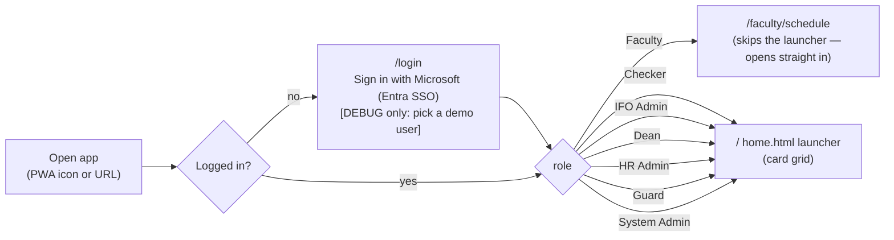
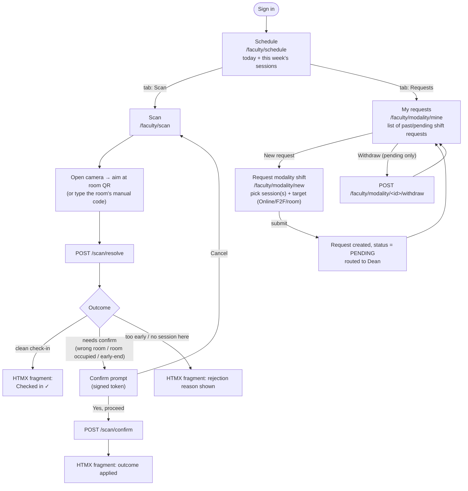
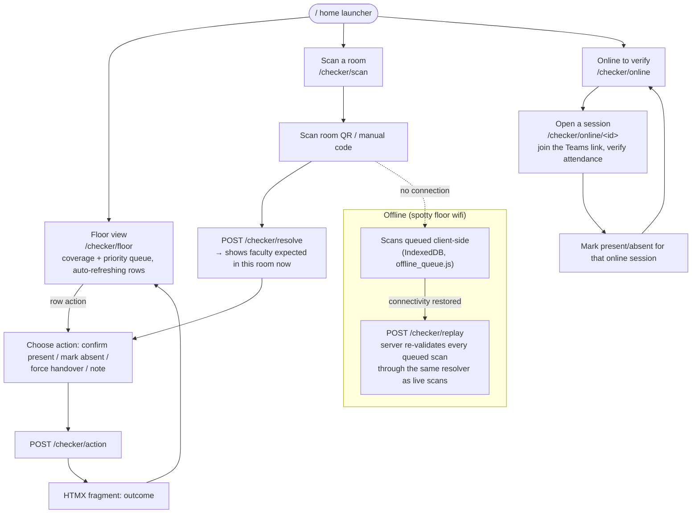
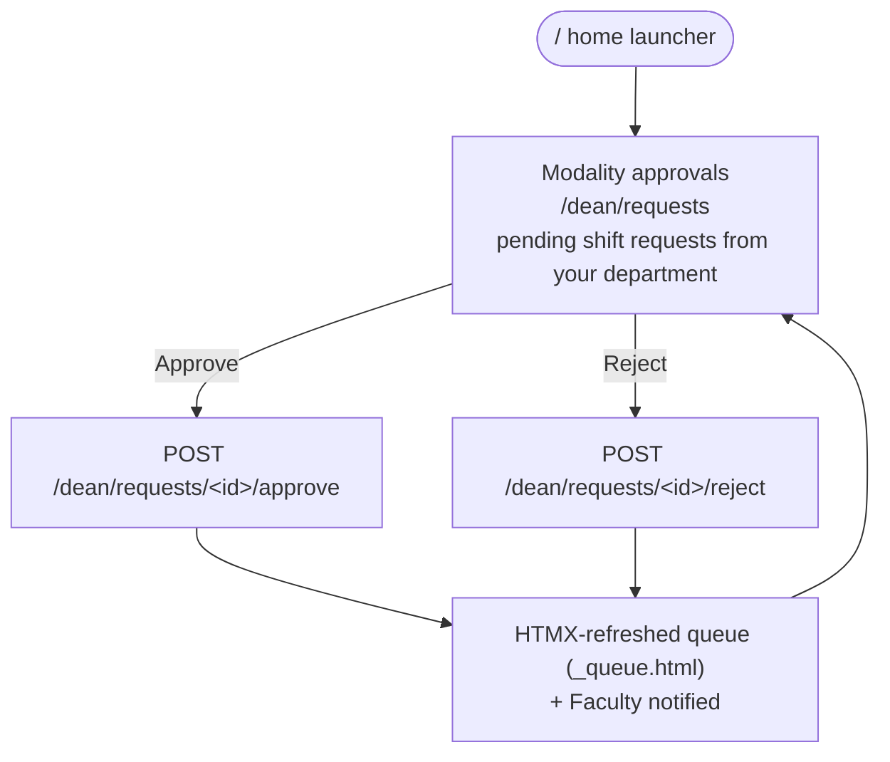
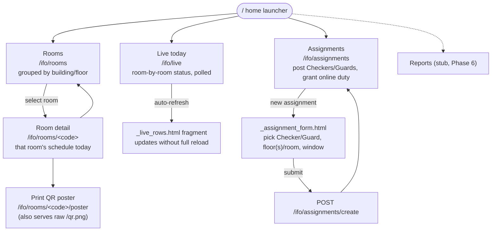
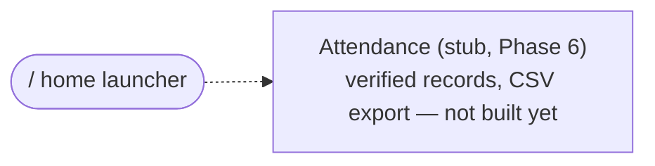
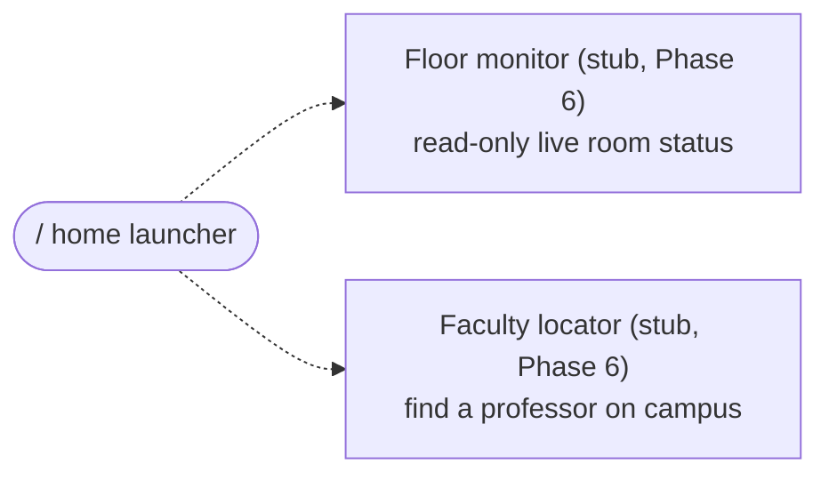
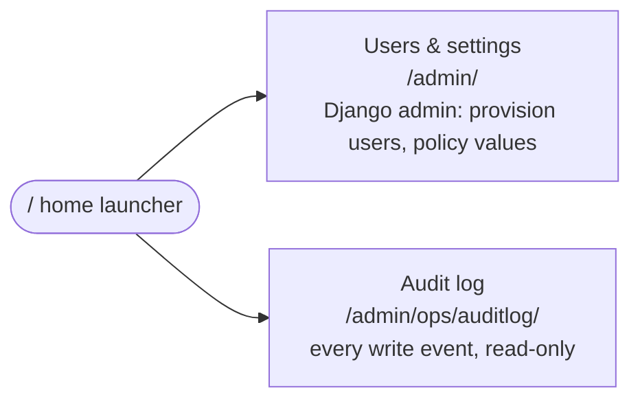

# FluxTrack — User Flows (by role)

> **What this is:** how each role actually moves through the app, screen to screen — not code
> layers (see [`docs/ARCHITECTURE.md`](./ARCHITECTURE.md)) and not infrastructure (see
> [`docs/IT_ARCHITECTURE.md`](./IT_ARCHITECTURE.md)). Traced from `web/urls.py`, the view modules,
> and `templates/`.

Every session starts the same way for everyone:

Faculty is the one role that never sees the card-grid launcher — `home()` redirects them straight
to Schedule so the bottom nav is present immediately. Every other role lands on `web/home.html`,
a grid of role-specific cards built from the `SURFACES` map in `web/views.py`. Cards pointing at
`#` are later-phase stubs (Reports, HR Attendance, Guard surfaces) — they render but do nothing yet.

Two persistent nav bars exist. **Faculty only** gets a bottom tab bar on mobile (`Schedule · Scan ·
Requests`) and its desktop mirror in the header — every other role navigates by returning to `/`
and picking a different card (no equivalent persistent nav yet). Every authenticated header shows
the role badge, full name, and **Sign out**; `is_staff` users also get an **Admin** shortcut to
Django admin.

---

## 1. Faculty

Persistent bottom nav (mobile) / header nav (desktop): **Schedule · Scan · Requests**.

**Screens:**
- **Schedule** (`faculty/schedule.html`) — today + week view; the faculty's landing screen.
- **Scan** (`faculty/scan.html`) — camera-based QR scan or manual code entry; deep-linked from a
  room's posted QR (`GET /scan?t=TOKEN`) as well as the nav tab. Outcome renders as an HTMX
  fragment (`faculty/_outcome.html`) in place — no full page reload.
- **Requests** — two screens: **My requests** (`modality_mine.html`, list + withdraw) and
  **New request** (`modality_new.html`, the submission form, `_modality_form.html` partial for
  validation re-renders). Approval itself happens on the Dean's side, not here — Faculty only sees
  the resulting status change when they revisit "My requests."

## 2. Checker

No persistent nav — always returns to `/` (home launcher) between surfaces.

**Screens:**
- **Floor view** (`checker/floor.html` + `_floor_rows.html`) — the checker's main dashboard: which
  rooms on their assigned floor(s) still need a walk-by, polled/refreshed via HTMX rows.
- **Scan a room** (`checker/scan.html`) — same QR/manual-code mechanic as Faculty's scan, but
  resolves *who's expected in this room right now* rather than the checker's own schedule.
- **Online to verify** (`checker/online_list.html` → `online_open.html`) — for checkers on
  *online-duty* assignment: a list of online sessions to confirm via Teams instead of a room walk.
- **Offline replay** is invisible as a "screen" — it's the same Scan UI, but failed submits queue
  locally and flush to `/checker/replay` later; the user experience is "it just works" even with
  no signal.

## 3. Dean

No persistent nav; single surface today.

**Screens:**
- **Modality approvals** (`dean/queue.html` + `_queue.html`) — the only wired Dean surface. Approve
  triggers room re-assignment/release inside `scheduling/services.py` (not visible to the Dean —
  they just see the request disappear from the pending queue and the Faculty gets notified).
  "Department oversight" (`#`) is a Phase 6 stub card on the home launcher.

## 4. IFO Admin

No persistent nav; three live surfaces + one stub.

**Screens:**
- **Rooms** (`ifo/rooms.html`) — building → floor → room browse; each room links to its **Room
  detail** (`room_detail.html`, that room's schedule for today) and from there to its **QR poster**
  (`poster.html`, printable, plus a raw `qr.png` endpoint used by the poster image itself).
- **Live today** (`ifo/live.html` + `_live_rows.html`) — campus-wide live occupancy, polled rows.
- **Assignments** (`ifo/assignments.html` + `_assignment_form.html`) — where Checker/Guard floor
  coverage and online-verification duty actually get posted; this is what makes the Checker's
  Floor view and Online list non-empty.
- **Reports** is a Phase 6 stub card — no screen behind it yet.

## 5. HR Admin

Fully stubbed today — one home-launcher card, no live screen.

## 6. Guard

Fully stubbed today — two home-launcher cards, no live screens.

## 7. System Admin

Bypasses FluxTrack's own UI entirely — routed straight into Django admin.

No custom FluxTrack templates for this role — both cards link into the stock Django admin site,
which is why `is_staff` users additionally get an **Admin** shortcut baked into every header (§ above).

---

## Cross-role notes

- **QR scanning is the one mechanic two roles share** (Faculty check-in, Checker verification) but
  it means different things: Faculty confirms *their own* attendance; Checker confirms *someone
  else's*. Same camera UI, same resolver shape server-side (see `ARCHITECTURE.md` §6), different
  question being answered.
- **Nothing routes a user into another role's screens.** Every view module has its own
  `*_required` decorator (`faculty_required`, `checker_required`, `dean_required`, `ifo_required`);
  a wrong-role request is refused, not redirected.
- **Stub cards (`href: "#"`) render but go nowhere** — Reports (IFO), Department oversight (Dean),
  Attendance (HR Admin), Floor monitor + Faculty locator (Guard). These are Phase 6 scope, not
  broken links.

*Companion documents: [`docs/ARCHITECTURE.md`](./ARCHITECTURE.md) (software/request-flow
architecture) · [`docs/IT_ARCHITECTURE.md`](./IT_ARCHITECTURE.md) (deployment topology).*
